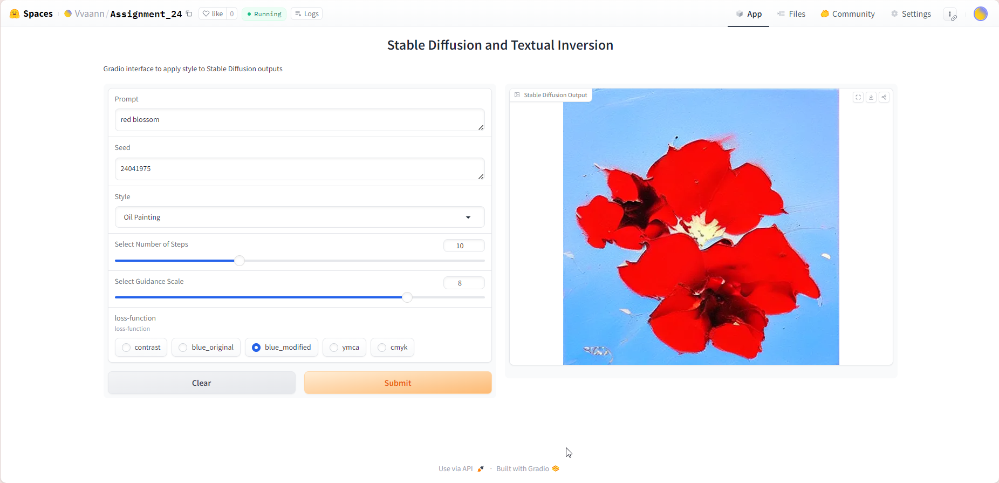

# Assignment 24

# Problem Statement

To create a gradio inference of stable diffusion with below conditions:

- select 5 different styles of your choice and show output for the same prompt using these 5 different styles from community-created SD concepts library
- apply your own variant of "blue_loss" (it cannot be red, green, or blue loss) on the same prompts with each concept library and store the results. 

# Description
Stable Diffusion is a technique in the field of generative artificial intelligence (AI) that aims to generate high-quality images. It is an extension of diffusion probabilistic models, which are a class of generative models used for image generation. Stable Diffusion is important because it addresses some of the limitations of earlier diffusion models, particularly in generating high-resolution and high-fidelity images.

Stable Diffusion represents a significant advancement in generative models by combining the strengths of diffusion processes with efficient latent space operations and powerful text-image alignment via CLIP. 

## Output

This assignment is for understanding the working and architecture of stable diffusion model. The implementation is done in hugging spaces in link below:
https://huggingface.co/spaces/Vvaann/Assignment_24

